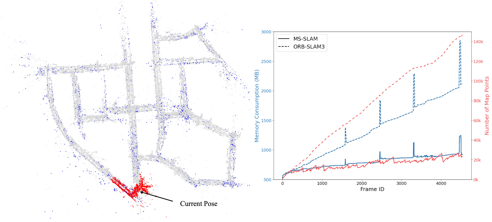

<div align="center">
<h2>MS-SLAM: Memory‐Efficient Visual SLAM with Sliding Window
Map Sparsification</h2>

[Xiaoyu Zhang](https://fishmarch.github.io/)<sup>1</sup>,
Jinhu Dong<sup>1</sup>,
[Yin Zhang](https://scholar.google.com/citations?user=BwX1pDAAAAAJ)<sup>2</sup>,
[Yun-Hui Liu](https://www4.mae.cuhk.edu.hk/peoples/liu-yun-hui/)<sup>1</sup>,

<sup>1</sup> The Chinese University of Hong Kong,
<sup>2</sup> Westlake University

Accepted by **[Journay of Field Robotics (JFR)](https://onlinelibrary.wiley.com/doi/10.1002/rob.22431)**
</div>

## Overview
While most visual SLAM systems traditionally prioritize accuracy or speed, 
the associated memory consumption would also become a concern for robots working in large‐scale environments, 
primarily due to the perpetual preservation of increasing number of redundant map points. 
Although these redundant map points are initially constructed to ensure robust frame tracking, 
they contribute little once the robot moves to other locations and are primarily kept for potential loop closure. 
After continuous optimization, these map points are accurate and actually not all of them are essential for loop closure. 
Therefore, this project proposes MS‐SLAM, a memory‐efficient visual SLAM system with Map Sparsification aimed at selecting only parts of useful map points to keep in the global map. 
In MS‐SLAM, all local map points are temporarily kept to ensure robust frame tracking and further optimization, 
while redundant non‐local map points are removed through the proposed novel sliding window map sparsification, 
which is efficient and running concurrently with original SLAM tracking. 
The loop closure still operates well with the selected useful map points.
Through exhaustive experiments across various scenes in both public and self‐collected datasets, 
MS‐SLAM has demonstrated comparable accuracy with the state‐of‐the‐art visual SLAM while significantly reducing memory consumption by over 70% in large‐scale scenes. 
This facilitates the scalability of visual SLAM in large‐scale environments, making it a promising solution for real‐world applications.


## Example
### [YouTube](https://youtu.be/D9RiF20K5qY)
<div align="center">

https://github.com/user-attachments/assets/3d33683c-194d-44fa-a2e0-9e4c73d72878

</div>

<div  align="center"> 

</div>
An example of our MS‐SLAM running on sequence KITTI‐00. 
All local map points (depicted in red) are kept for robust frame tracking.
Other non‐local map points are depicted in blue and gray, from which only the most valuable ones (depicted in blue) are selected through online
map sparsification in MS‐SLAM. 
Note that only red and blue points are maintained in the global map, while gray points are just drawn for illustration.
In this example, only 10.9% of original map points are kept and the memory consumption is reduced by over 70%.
The comparison of memory with ORB-SLAM3 is illustrated in the following figure.


## Installation
This project is built on [ORB-SLAM3](https://github.com/UZ-SLAMLab/ORB_SLAM3). 
Please follow their instruction to install most prerequisites.

You also need to install the optimization tool [GUROBI](https://www.gurobi.com), and remember to modify ``cmake_modules/FindGUROBI.cmake`` based on your own installation. 

## Running
Currently, we test with stereo and stereo-inertial mode, and provide following examples running on different datasets.

### [EuRoC](https://projects.asl.ethz.ch/datasets/doku.php?id=kmavvisualinertialdatasets)
#### Stereo
```
Examples/Stereo/stereo_euroc Vocabulary/ORBvoc.txt Examples/Stereo/EuRoC.yaml PATH_TO_SEQUENCE_FOLDER Examples/Stereo/EuRoC_TimeStamps/SEQUENCE.txt
```
#### Stereo-Inertial
```
Examples/Stereo-Inertial/stereo_inertial_euroc Vocabulary/ORBvoc.txt Examples/Stereo-Inertial/EuRoC.yaml PATH_TO_SEQUENCE_FOLDER Examples/Stereo-Inertial/EuRoC_TimeStamps/SEQUENCE.txt
```

### [KITTI](https://www.cvlibs.net/datasets/kitti/eval_odometry.php)
#### Stereo
```
Examples/Stereo/stereo_kitti Vocabulary/ORBvoc.txt Examples/Stereo/KITTIX.yaml PATH_TO_SEQUENCE_FOLDER
```

### [4Seasons](https://www.4seasons-dataset.com)
#### Stereo-Inertial
```
Examples/Stereo-Inertial/stereo_inertial_4season Vocabulary/ORBvoc.txt Examples/Stereo-Inertial/4season.yaml PATH_TO_SEQUENCE_FOLDER
```

## Citation
If you find this project is useful in your research or applications, 
please consider giving us a star 🌟 and citing it by the following BibTeX entry.
```bibtex
@article{
  author = {Zhang, Xiaoyu and Dong, Jinhu and Zhang, Yin and Liu, Yun-Hui},
  title = {MS-SLAM: Memory-Efficient Visual SLAM With Sliding Window Map Sparsification},
  journal = {Journal of Field Robotics},
  doi = {https://doi.org/10.1002/rob.22431},
  url = {https://onlinelibrary.wiley.com/doi/abs/10.1002/rob.22431},
}
```


